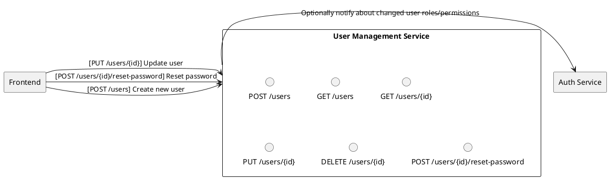
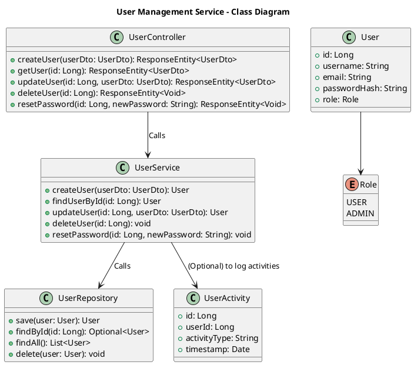

# User Management Service

## Overview
Manages **user profiles**, **roles**, and **permissions**. This service is the central point for user-related operations, while the Auth Service handles token issuance and validation.

---

## Responsibilities
1. **User CRUD Operations**
    - Create, read, update, delete user profiles.
2. **Roles & Permissions**
    - Maintain simple role-based access (two roles: `admin`, `user`).
3. **User Activity Tracking**
    - Log user actions (e.g., login time, changes to user settings) for auditing (optional).
4. **Password Reset & Change**
    - **Best-Practice Suggestion**: Expose endpoints for handling password resets and changes, triggered by the Auth Service or the Frontend.

---

## Proposed Architecture

### Textual Description
- Runs as a **Spring Boot** microservice on **PostgreSQL**.
- Stores user details: username, email, hashed passwords, roles, and optional activity logs.
- Provides secure REST endpoints for user account management.

### Class diagram

**Explanation**

- **UserController**: REST endpoints for creating, reading, updating, deleting users, and handling password resets.
- **UserService**: Business logic for managing users, including interactions with the repository and optional activity logging.
- **UserRepository**: Spring Data interface for database operations (e.g., PostgreSQL).
- **User**: Entity representing a user record in the database.
- **Role**: Simple enum for user roles.
- **UserActivity** (Optional): Entity to log user-related events (logins, resets, etc.).

---

## Interfaces
1. **Auth Service**
    - **Type**: REST (internal)
    - **Purpose**: Validating user credentials, notifying about role changes if needed.
2. **Frontend**
    - **Type**: REST
    - **Purpose**: Creating/updating user profiles, resetting passwords, etc.

---

## Database
- **Primary DB**: PostgreSQL
    - Table: `users` (username, email, password_hash, role, etc.)
    - Table: `user_activity` (optional, for logging significant events).

---

## Security & Maintenance
- **Best-Practice Suggestion**: Use strong password policies and hashed (bcrypt, Argon2, etc.) storage.
- **Best-Practice Suggestion**: Implement rate limiting on user creation/reset endpoints to prevent abuse.

---

## Project Information
- **Programming Language**: Java (version 21)
- **Framework**: Spring Boot 3.4.1
- **Build Tool**: Maven
- **Dependencies**:
    - Spring Boot Starters (Actuator, Data JPA, Security, Validation, Web, Mail)
    - Lombok
    - PostgreSQL Driver
    - Micrometer (InfluxDB)
    - Spring Boot Docker Compose
    - Spring Boot DevTools (for development)
    - Spring Boot Starter Test (for testing)
    - Spring Security Test (for security testing)
- **SCM Repository**: [GitHub - User Management Service](https://github.com/doemefu/user-management-service)
- **License**: Apache License, Version 2.0 ([link](https://www.apache.org/licenses/LICENSE-2.0))
- **Issues**: [GitHub Issues](https://github.com/doemefu/user-management-service/issues)
