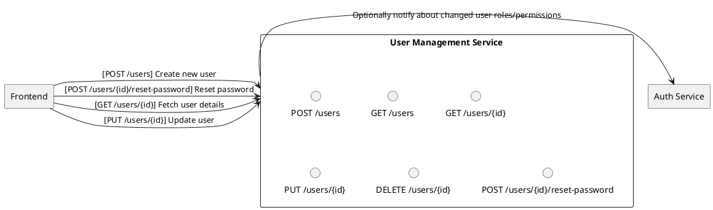
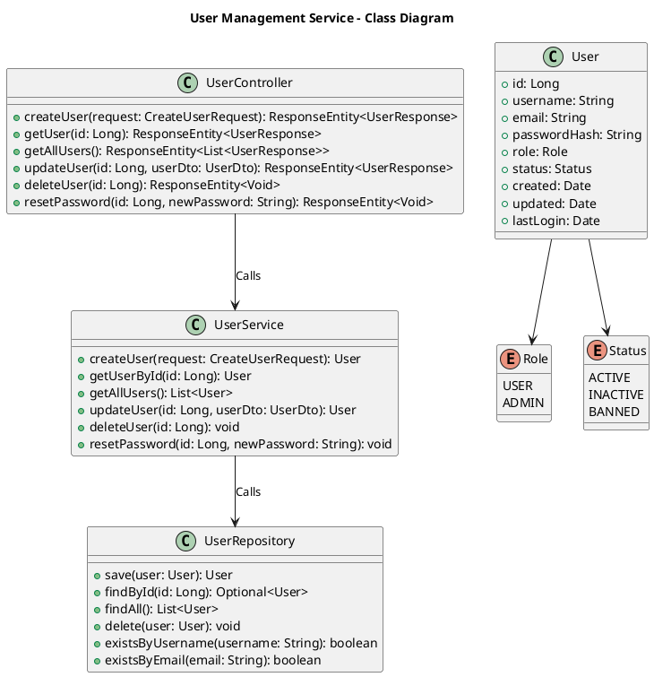

# User Management Service

## Overview
Manages **user profiles**, **roles**, and **permissions**. This service is the central point for user-related operations, while the Auth Service handles token issuance and validation.

---

## Responsibilities
1. **User CRUD Operations**
    - Create, read, update, delete user profiles.
2. **Roles & Permissions**
    - Maintain simple role-based access (two roles: `admin`, `user`).
3. **User Activity Tracking**
    - Log user actions (e.g., login time, changes to user settings) for auditing (optional).
4. **Password Reset & Change**
    - Provide secure endpoints for password reset and change functionality.
5. **API Endpoints**
    - `/users`: Manage user profiles.
    - `/users/{id}`: Operate on a specific user by ID.
    - `/users/{id}/reset-password`: Reset a user's password securely.

---

## Architecture

### Textual Description
- Runs as a **Spring Boot** microservice on **PostgreSQL**.
- Stores user details: username, email, hashed passwords, roles, and optional activity logs.
- Provides secure REST endpoints for user account management.

---

### Sequence Diagram

---

### Class Diagram

---

## Database Schema
- **Users Table**:
    - `id` (Primary Key)
    - `username` (Unique, Non-Nullable)
    - `email` (Unique, Non-Nullable)
    - `password_hash` (Non-Nullable)
    - `role` (Enum: USER, ADMIN)
    - `status` (Enum: ACTIVE, INACTIVE, BANNED)
    - `created` (Timestamp)
    - `updated` (Timestamp)
    - `last_login` (Timestamp, Nullable)

---

## Security
- **Password Hashing**: Uses `PasswordEncoder` for secure password storage (e.g., BCrypt).
- **Validation**:
    - Ensures usernames and emails are unique.
    - Validates email format and non-empty passwords.
- **Access Control**: Roles (`USER`, `ADMIN`) define access permissions.

---

## Project Information
- **Programming Language**: Java (version 21)
- **Framework**: Spring Boot 3.4.1
- **Build Tool**: Maven
- **Dependencies**:
    - Spring Boot Starters (Actuator, Data JPA, Security, Validation, Web, Mail)
    - OAuth2 Resource Server
    - Lombok
    - PostgreSQL Driver
    - Micrometer (InfluxDB)
    - Spring Boot Docker Compose
    - Spring Boot DevTools (for development)
    - Spring Boot Starter Test (for testing)
    - Spring Security Test (for security testing)
- **SCM Repository**: [GitHub - User Management Service](https://github.com/doemefu/user-management-service)
- **License**: Apache License, Version 2.0 ([link](https://www.apache.org/licenses/LICENSE-2.0))
- **Issues**: [GitHub Issues](https://github.com/doemefu/user-management-service/issues)

---

## Endpoints Summary
- **POST /users**: Create a new user.
- **GET /users/{id}**: Fetch details of a specific user.
- **GET /users**: Fetch all users.
- **PUT /users/{id}**: Update user information.
- **DELETE /users/{id}**: Delete a user by ID.
- **POST /users/{id}/reset-password**: Reset a user's password.

---